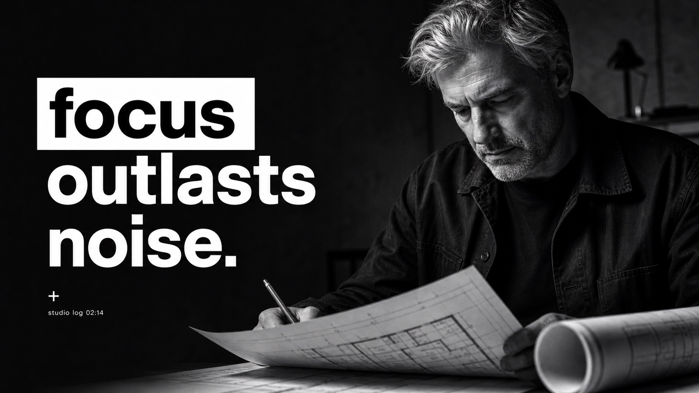
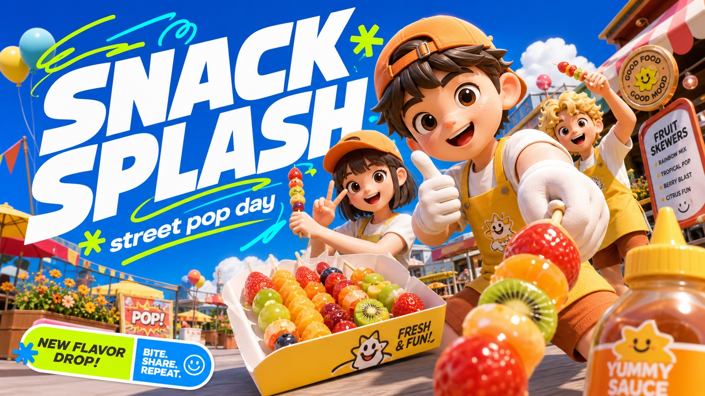
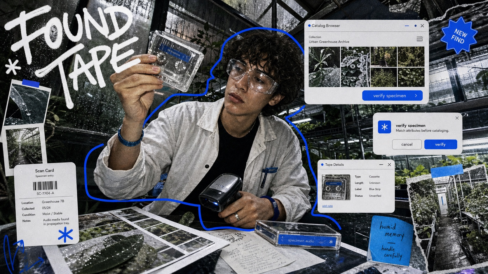
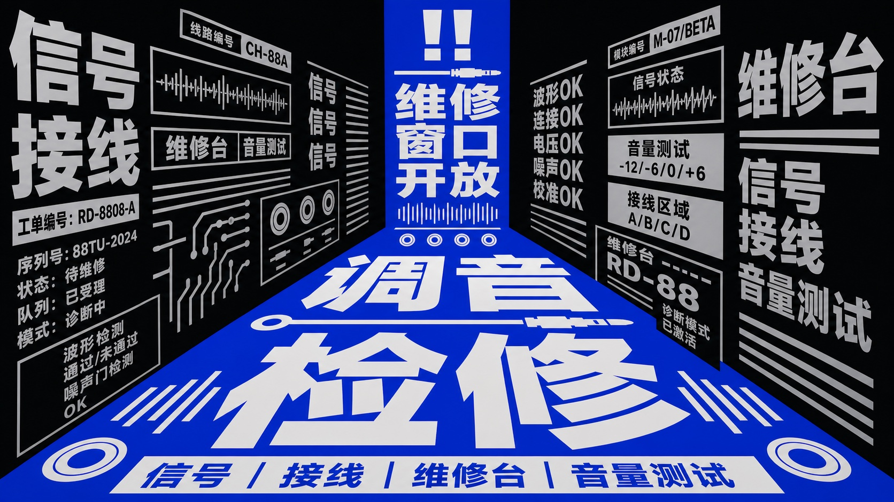
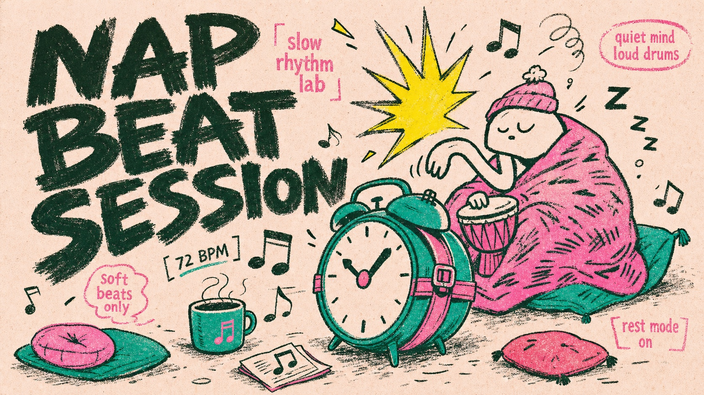
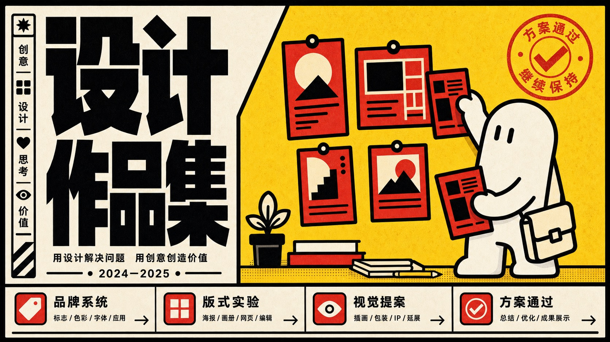
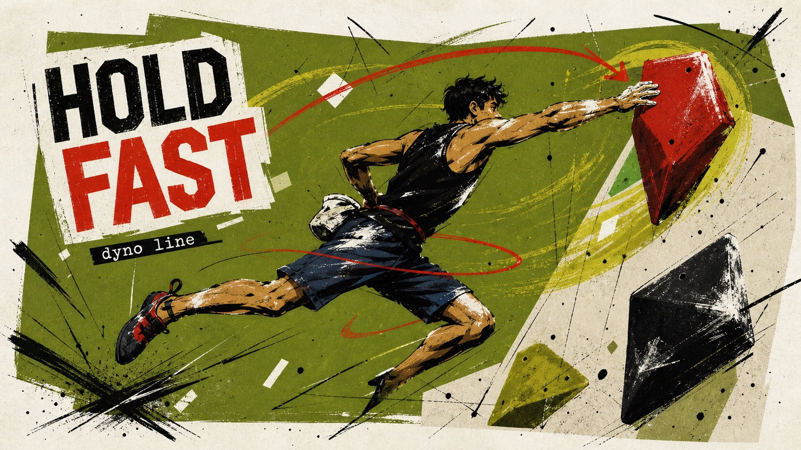

<h1 align="center">AI Visual Prompt Cookbook</h1>

<p align="center">
  
</p>

<p align="center">
  English |
  <a href="README.zh-CN.md">简体中文</a> |
  <a href="README.zh-TW.md">繁體中文</a> |
  <a href="README.ja.md">日本語</a> |
  <a href="README.ko.md">한국어</a> |
  <a href="README.id.md">Bahasa Indonesia</a>
</p>

<p align="center">
  
  
  
  
</p>

<p align="center">
  <strong>Copy a JSON, get a style.</strong> Drop one <code>style.json</code> into ChatGPT, Claude, Nano Banana Pro, or any LLM image workflow. Replace the variables, keep the visual system.
</p>

<p align="center">
  A curated library of plug-and-play visual prompt styles for AI image generation, distilled from visual design references and structured for more consistent, reusable output.
</p>

<p align="center">
  Curated by <a href="https://x.com/VigoCreativeAI">@VigoCreativeAI</a>, structured with assistance from OpenAI Codex. Star this repo to follow new style drops.
</p>

<p align="center">
  Browse the <a href="#all-styles">All Styles gallery</a> or open the <a href="docs/CATALOG.md">full catalog</a>.
</p>

## Quick Links

| Category | Good for | Start with |
| --- | --- | --- |
| Photo + Doodle | Social snapshots, lifestyle scenes, playful overlays | [Playful Mascot Doodle Snapshot](#playful-mascot-doodle-snapshot-style), [Subway Doodle Photo Hybrid](#subway-doodle-photo-hybrid-style) |
| Zine + Collage | Fashion posters, music visuals, maximalist editorial layouts | [K-pop Apocalypse Ransom Zine](#k-pop-apocalypse-ransom-zine-style), [Y2K Grunge Hip-hop Cutout Poster](#y2k-grunge-hiphop-cutout-poster-style) |
| Type Posters | Big headline systems, loud campaign graphics, visual punch | [Impact Burst Halftone Comic Poster](#impact-burst-halftone-comic-poster-style), [Neon Kinetic Typographic Poster](#neon-kinetic-typographic-poster-style) |
| Travel + City | Destination posters, street scenes, urban diaries | [Clean Triptych Travel Vlog Thumbnail](#clean-triptych-travel-vlog-thumbnail-style), [Tokyo Kawaii Travel Collage Poster](#tokyo-kawaii-travel-collage-poster-style) |
| Editorial + Minimal | Cleaner compositions, structured layouts, quieter art direction | [Tri Color Hardcut Portrait Poster](#tri-color-hardcut-portrait-poster-style), [Soft Analog Future Editorial Poster](#soft-analog-future-editorial-poster-style) |

## Why This Exists

Most AI image prompts are one-off text blobs: hard to reuse, hard to compare, and hard to iterate on. This repo takes a different approach: each visual style is distilled into a structured `style.json` you can drop into any LLM-based image generation workflow. Same JSON, more consistent style direction across generations.

## Quick Start

1. Browse the [Featured Styles](#featured-styles), [Quick Links](#quick-links), or [All Styles](#all-styles).
2. Open a style folder and copy the `style.json`.
3. Paste the full JSON into ChatGPT, Claude, Nano Banana Pro, or any LLM-based image workflow.
4. Provide your own values for the variables declared in `environment_variables`, or edit a case in `examples[*].values`.
5. Generate the final image prompt and send it to your image model.

See the [Complete Example](#complete-example) below for a full input-to-output walkthrough.

### Recommended Image Models

This workflow works best with end-to-end multimodal image models that can read long structured JSON prompts and generate the final image in one step.

- ChatGPT Images 2 (OpenAI, gpt-image-2) — strong text rendering, 2K/4K output, reasoning before generation
- Nano Banana Pro (Google, Gemini 3 Pro Image) — 4K output, multilingual text accuracy, strong subject consistency

Other multimodal LLMs that accept long JSON prompts may also work but are not the primary recommendation.

## Complete Example

### Input → Output Walkthrough

This example uses [Mono Noir Type Portrait Poster Style](styles/mono-noir-type-portrait-poster-style/).

#### Step 1 — The Style

<details>
<summary>prompt_template excerpt</summary>

```text
Create a {ASPECT_RATIO} monochrome editorial poster in the Mono Noir Type Portrait Poster Style. Style fidelity lock: {STYLE_FIDELITY_ANCHORS}. Source content to avoid: {SOURCE_CONTENT_TO_AVOID}. Scene: {SUBJECT} {SUBJECT_ACTION} with {PRODUCT_OR_PROP} in {LOCATION}. Background elements: {BACKGROUND_ELEMENTS}. Wardrobe and styling: {WARDROBE_STYLE}. Composition: one large high-contrast black-and-white photographic subject, close crop, deep charcoal background, sparse negative space, shallow depth of field, serious noir editorial mood. If the aspect ratio is 16:9, make a landscape poster with the subject weighted to the right side and the headline block on the left. If the aspect ratio is 9:16, make a vertical poster with the headline stacked in the upper-left or middle-left field and the subject cropped large on the right or lower-right. Typography: render the exact readable lowercase headline text "{MAIN_TEXT}" as three short left-aligned lines...
```

</details>

#### Step 2 — Your Variables

```text
SUBJECT = a tired architect with silver hair
SUBJECT_ACTION = studying a folded blueprint in a late-night pause
PRODUCT_OR_PROP = a rolled plan tube and a pencil held low
LOCATION = a dim concrete studio after midnight
BACKGROUND_ELEMENTS = soft charcoal wall gradient, blurred drafting table edge, deep empty space
MAIN_TEXT = focus / outlasts / noise.
SECONDARY_TEXT = studio log 02:14
ACCENT_SYMBOL = a tiny white plus
WARDROBE_STYLE = dark work jacket over a plain black shirt
ASPECT_RATIO = 16:9
```

#### Step 3 — The Final Prompt

```text
Create a 16:9 monochrome editorial poster in the Mono Noir Type Portrait Poster Style. Style fidelity lock: black-and-white photographic portrait, deep charcoal background, giant lowercase left-aligned headline, first word in a white label, remaining words in white, high contrast, sparse negative space, close crop. Source content to avoid: no young woman with blunt bangs, no freckles close-up, no discipline beats procrastination text, no copied face or exact source crop. Scene: a tired architect with silver hair studying a folded blueprint in a late-night pause with a rolled plan tube and a pencil held low in a dim concrete studio after midnight. Background elements: soft charcoal wall gradient, blurred drafting table edge, deep empty space. Wardrobe and styling: dark work jacket over a plain black shirt. Composition: one large high-contrast black-and-white photographic subject, close crop, deep charcoal background, sparse negative space, shallow depth of field, serious noir editorial mood. If the aspect ratio is 16:9, make a landscape poster with the subject weighted to the right side and the headline block on the left. If the aspect ratio is 9:16, make a vertical poster with the headline stacked in the upper-left or middle-left field and the subject cropped large on the right or lower-right. Typography: render the exact readable lowercase headline text "focus
outlasts
noise." as three short left-aligned lines with tight leading; put the first headline word as black type inside a crisp white rectangular label, then set the remaining lines in heavy white type directly on the dark background. Add "studio log 02:14" only as tiny unobtrusive white microcopy if it fits. Use a tiny white plus only as a minimal typographic mark. Keep type sharp, flat, square-cornered, and massive. Photo treatment: realistic black-and-white studio photography, strong shadow falloff, visible facial or fabric texture, subtle grain, no color, no illustration, no collage, no extra panels, no logos, no watermark.
```

#### Step 4 — The Result



## Copy Prompt Library

Prefer the short path? Browse the generated [Copy Prompt Library](docs/copy-prompts/README.md) for a copy-ready prompt per style. The full reusable style systems still live in each `style.json`.

## Featured Styles

Six visual systems to start with. Every style ships as one JSON plus two preview images. Browse the complete set of 44 in the [All Styles](#all-styles) gallery below.

<!-- HTML table used for rich image+link cells -->

<table>
<tr>
<td width="33%" valign="top">
<a href="styles/sunny-3d-avatar-campaign-style"></a>
<h3>Sunny 3D Avatar Campaign Style</h3>
<p>A bright social campaign 3D style with glossy toy-like avatars, blue-sky outdoor light, wide-angle perspective, oversized slanted headlines, neon motion marks, and rounded sticker labels.</p>
<p><a href="styles/sunny-3d-avatar-campaign-style/style.json"><strong>Open style.json</strong></a> · <a href="docs/copy-prompts/sunny-3d-avatar-campaign-style.md">Copy Prompt</a> · <a href="styles/sunny-3d-avatar-campaign-style">Folder</a></p>
</td>
<td width="33%" valign="top">
<a href="styles/y2k-mirror-ui-scribble-collage-style"></a>
<h3>Y2K Mirror UI Scribble Collage Style</h3>
<p>A gritty Y2K screen-collage style with flash photography, floating UI fragments, electric-blue marker outlines, handwritten headline lettering, and dense digital noise.</p>
<p><a href="styles/y2k-mirror-ui-scribble-collage-style/style.json"><strong>Open style.json</strong></a> · <a href="docs/copy-prompts/y2k-mirror-ui-scribble-collage-style.md">Copy Prompt</a> · <a href="styles/y2k-mirror-ui-scribble-collage-style">Folder</a></p>
</td>
<td width="33%" valign="top">
<a href="styles/neon-plush-gadget-pop-3d-style"></a>
<h3>Neon Plush Gadget Pop 3D Style</h3>
<p>A bright collectible toy-advertising 3D style with acid-lime studio fields, oversized fuzzy plush mascots, chunky gadget props, glossy jelly accessories, hot-pink bursts, checkerboards, stickers, and high-key commercial lighting.</p>
<p><a href="styles/neon-plush-gadget-pop-3d-style/style.json"><strong>Open style.json</strong></a> · <a href="docs/copy-prompts/neon-plush-gadget-pop-3d-style.md">Copy Prompt</a> · <a href="styles/neon-plush-gadget-pop-3d-style">Folder</a></p>
</td>
</tr>
<tr>
<td width="33%" valign="top">
<a href="styles/blue-lime-kinetic-comic-type-poster-style"></a>
<h3>Blue Lime Kinetic Comic Type Poster Style</h3>
<p>A loud blue-and-lime comic type poster style with giant black Chinese block lettering, yellow back plates, radial action marks, and gritty print texture.</p>
<p><a href="styles/blue-lime-kinetic-comic-type-poster-style/style.json"><strong>Open style.json</strong></a> · <a href="docs/copy-prompts/blue-lime-kinetic-comic-type-poster-style.md">Copy Prompt</a> · <a href="styles/blue-lime-kinetic-comic-type-poster-style">Folder</a></p>
</td>
<td width="33%" valign="top">
<a href="styles/blue-chinese-perspective-type-canyon-style"></a>
<h3>Blue Chinese Perspective Type Canyon Style</h3>
<p>A Chinese typographic poster system built from an extreme one-point perspective corridor: a saturated blue central trapezoid plane carries stacked oversized white Chinese display type, while black side walls are packed with warped white and pale gray Chinese support copy.</p>
<p><a href="styles/blue-chinese-perspective-type-canyon-style/style.json"><strong>Open style.json</strong></a> · <a href="docs/copy-prompts/blue-chinese-perspective-type-canyon-style.md">Copy Prompt</a> · <a href="styles/blue-chinese-perspective-type-canyon-style">Folder</a></p>
</td>
<td width="33%" valign="top">
<a href="styles/rough-ink-music-doodle-poster-style"></a>
<h3>Rough Ink Music Doodle Poster Style</h3>
<p>A rough hand-inked poster style built from oversized dark green-black brush lettering, pale blush paper, hot pink secondary type, naive mascot drawings, teal and pink flat fills, sharp yellow burst marks, scattered music-note doodles, and scanned risograph-like print texture.</p>
<p><a href="styles/rough-ink-music-doodle-poster-style/style.json"><strong>Open style.json</strong></a> · <a href="docs/copy-prompts/rough-ink-music-doodle-poster-style.md">Copy Prompt</a> · <a href="styles/rough-ink-music-doodle-poster-style">Folder</a></p>
</td>
</tr>
</table>

## Package Shape

```text
styles/<style-slug>/
  style.json          # Machine-readable prompt template
  preview-16x9.jpg    # Landscape preview
  preview-9x16.jpg    # Portrait preview
```

## style.json v2.1

Every `style.json` is self-contained: copy the whole file into your LLM, then provide values for the variables declared in `environment_variables` or edit one of the `examples[*].values` cases.

- `prompt_template` is the reusable style prompt with `{VARIABLE}` placeholders.
- `environment_variables` declares every placeholder the template can use.
- `examples` contains ready-to-edit cases; each case stores only `case_name` and `values`.
- `style_fidelity_anchors` and `source_content_to_avoid` tell the model what to preserve and what not to copy.
- `negative_prompt` keeps watermarks, logos, direct source recreations, and off-style outputs away.

Rendered prompts such as `prompt_9x16`, `prompt_16x9`, or `full_prompt` are intentionally not stored. They are derived at generation time from `prompt_template` plus chosen values, so the JSON stays compact and does not drift.

Validate the library with:

```bash
python3 scripts/validate-style-json.py .
```


## All Styles

Browse all 44 styles below.

The complete library, including the featured styles above. For full descriptions and all file links per style, see [docs/CATALOG.md](docs/CATALOG.md).

<!-- HTML table used for rich image+link cells -->

<table>
<tr>
<td width="33%" valign="top">
<a id="sunny-3d-avatar-campaign-style"></a>
<a href="styles/sunny-3d-avatar-campaign-style"></a>
<p><strong><a href="styles/sunny-3d-avatar-campaign-style">Sunny 3D Avatar Campaign Style</a></strong><br>
<em>Sunny campaign 3D avatars with blue skies, bold type, and neon motion marks.</em><br>
<a href="styles/sunny-3d-avatar-campaign-style/style.json">style.json</a> · <a href="docs/copy-prompts/sunny-3d-avatar-campaign-style.md">prompt</a> · <a href="styles/sunny-3d-avatar-campaign-style/preview-9x16.jpg">9:16</a></p>
</td>
<td width="33%" valign="top">
<a id="y2k-mirror-ui-scribble-collage-style"></a>
<a href="styles/y2k-mirror-ui-scribble-collage-style"></a>
<p><strong><a href="styles/y2k-mirror-ui-scribble-collage-style">Y2K Mirror UI Scribble Collage Style</a></strong><br>
<em>Flash-photo Y2K collages with mirror UI panels and electric-blue scribbles.</em><br>
<a href="styles/y2k-mirror-ui-scribble-collage-style/style.json">style.json</a> · <a href="docs/copy-prompts/y2k-mirror-ui-scribble-collage-style.md">prompt</a> · <a href="styles/y2k-mirror-ui-scribble-collage-style/preview-9x16.jpg">9:16</a></p>
</td>
<td width="33%" valign="top">
<a id="neon-plush-gadget-pop-3d-style"></a>
<a href="styles/neon-plush-gadget-pop-3d-style"></a>
<p><strong><a href="styles/neon-plush-gadget-pop-3d-style">Neon Plush Gadget Pop 3D Style</a></strong><br>
<em>Neon toy-product 3D renders with plush mascots and chunky gadget props.</em><br>
<a href="styles/neon-plush-gadget-pop-3d-style/style.json">style.json</a> · <a href="docs/copy-prompts/neon-plush-gadget-pop-3d-style.md">prompt</a> · <a href="styles/neon-plush-gadget-pop-3d-style/preview-9x16.jpg">9:16</a></p>
</td>
</tr>
<tr>
<td width="33%" valign="top">
<a id="blue-lime-kinetic-comic-type-poster-style"></a>
<a href="styles/blue-lime-kinetic-comic-type-poster-style"></a>
<p><strong><a href="styles/blue-lime-kinetic-comic-type-poster-style">Blue Lime Kinetic Comic Type Poster Style</a></strong><br>
<em>Electric-blue comic posters with lime speech panels and massive black type.</em><br>
<a href="styles/blue-lime-kinetic-comic-type-poster-style/style.json">style.json</a> · <a href="docs/copy-prompts/blue-lime-kinetic-comic-type-poster-style.md">prompt</a> · <a href="styles/blue-lime-kinetic-comic-type-poster-style/preview-9x16.jpg">9:16</a></p>
</td>
<td width="33%" valign="top">
<a id="blue-chinese-perspective-type-canyon-style"></a>
<a href="styles/blue-chinese-perspective-type-canyon-style"></a>
<p><strong><a href="styles/blue-chinese-perspective-type-canyon-style">Blue Chinese Perspective Type Canyon Style</a></strong><br>
<em>Blue perspective corridors with stacked Chinese display type.</em><br>
<a href="styles/blue-chinese-perspective-type-canyon-style/style.json">style.json</a> · <a href="docs/copy-prompts/blue-chinese-perspective-type-canyon-style.md">prompt</a> · <a href="styles/blue-chinese-perspective-type-canyon-style/preview-9x16.jpg">9:16</a></p>
</td>
<td width="33%" valign="top">
<a id="rough-ink-music-doodle-poster-style"></a>
<a href="styles/rough-ink-music-doodle-poster-style"></a>
<p><strong><a href="styles/rough-ink-music-doodle-poster-style">Rough Ink Music Doodle Poster Style</a></strong><br>
<em>Hand-inked music posters with brush lettering and playful doodles.</em><br>
<a href="styles/rough-ink-music-doodle-poster-style/style.json">style.json</a> · <a href="docs/copy-prompts/rough-ink-music-doodle-poster-style.md">prompt</a> · <a href="styles/rough-ink-music-doodle-poster-style/preview-9x16.jpg">9:16</a></p>
</td>
</tr>
<tr>
<td width="33%" valign="top">
<a id="mono-noir-type-portrait-poster-style"></a>
<a href="styles/mono-noir-type-portrait-poster-style"></a>
<p><strong><a href="styles/mono-noir-type-portrait-poster-style">Mono Noir Type Portrait Poster Style</a></strong><br>
<em>Black-and-white editorial portraits with massive lowercase type.</em><br>
<a href="styles/mono-noir-type-portrait-poster-style/style.json">style.json</a> · <a href="docs/copy-prompts/mono-noir-type-portrait-poster-style.md">prompt</a> · <a href="styles/mono-noir-type-portrait-poster-style/preview-9x16.jpg">9:16</a></p>
</td>
<td width="33%" valign="top">
<a id="bold-block-mascot-poster-style"></a>
<a href="styles/bold-block-mascot-poster-style"></a>
<p><strong><a href="styles/bold-block-mascot-poster-style">Bold Block Mascot Poster Style</a></strong><br>
<em>Flat mascot posters with chunky block type and sticker figures.</em><br>
<a href="styles/bold-block-mascot-poster-style/style.json">style.json</a> · <a href="docs/copy-prompts/bold-block-mascot-poster-style.md">prompt</a> · <a href="styles/bold-block-mascot-poster-style/preview-9x16.jpg">9:16</a></p>
</td>
<td width="33%" valign="top">
<a id="blue-hud-macro-product-poster"></a>
<a href="styles/blue-hud-macro-product-poster"></a>
<p><strong><a href="styles/blue-hud-macro-product-poster">Blue HUD Macro Creator Tech Poster</a></strong><br>
<em>Glossy macro product posters with blue HUD launch graphics.</em><br>
<a href="styles/blue-hud-macro-product-poster/style.json">style.json</a> · <a href="docs/copy-prompts/blue-hud-macro-product-poster.md">prompt</a> · <a href="styles/blue-hud-macro-product-poster/preview-9x16.jpg">9:16</a></p>
</td>
</tr>
<tr>
<td width="33%" valign="top">
<a id="warm-fisheye-product-impact-ad-style"></a>
<a href="styles/warm-fisheye-product-impact-ad-style"></a>
<p><strong><a href="styles/warm-fisheye-product-impact-ad-style">Warm Fisheye Product Impact Ad</a></strong><br>
<em>Warm fisheye product ads with bold Chinese social-commerce type.</em><br>
<a href="styles/warm-fisheye-product-impact-ad-style/style.json">style.json</a> · <a href="docs/copy-prompts/warm-fisheye-product-impact-ad-style.md">prompt</a> · <a href="styles/warm-fisheye-product-impact-ad-style/preview-9x16.jpg">9:16</a></p>
</td>
<td width="33%" valign="top">
<a id="olive-scribble-sports-poster-style"></a>
<a href="styles/olive-scribble-sports-poster-style"></a>
<p><strong><a href="styles/olive-scribble-sports-poster-style">Olive Scribble Sports Poster</a></strong><br>
<em>Handmade sports posters with olive blocks and kinetic scribbles.</em><br>
<a href="styles/olive-scribble-sports-poster-style/style.json">style.json</a> · <a href="docs/copy-prompts/olive-scribble-sports-poster-style.md">prompt</a> · <a href="styles/olive-scribble-sports-poster-style/preview-9x16.jpg">9:16</a></p>
</td>
<td width="33%" valign="top">
<a id="bold-anime-reaction-thumbnail-style"></a>
<a href="styles/bold-anime-reaction-thumbnail-style"></a>
<p><strong><a href="styles/bold-anime-reaction-thumbnail-style">Bold Anime Reaction Thumbnail</a></strong><br>
<em>High-impact anime thumbnails with bold yellow reaction typography.</em><br>
<a href="styles/bold-anime-reaction-thumbnail-style/style.json">style.json</a> · <a href="docs/copy-prompts/bold-anime-reaction-thumbnail-style.md">prompt</a> · <a href="styles/bold-anime-reaction-thumbnail-style/preview-9x16.jpg">9:16</a></p>
</td>
</tr>
<tr>
<td width="33%" valign="top">
<a id="turquoise-red-techno-manga-poster-style"></a>
<a href="styles/turquoise-red-techno-manga-poster-style"></a>
<p><strong><a href="styles/turquoise-red-techno-manga-poster-style">Turquoise Red Techno Manga Poster</a></strong><br>
<em>Retro techno-manga posters with turquoise hardware and red lettering.</em><br>
<a href="styles/turquoise-red-techno-manga-poster-style/style.json">style.json</a> · <a href="docs/copy-prompts/turquoise-red-techno-manga-poster-style.md">prompt</a> · <a href="styles/turquoise-red-techno-manga-poster-style/preview-9x16.jpg">9:16</a></p>
</td>
<td width="33%" valign="top">
<a id="chromatic-fisheye-orbit-pop-poster-style"></a>
<a href="styles/chromatic-fisheye-orbit-pop-poster-style"></a>
<p><strong><a href="styles/chromatic-fisheye-orbit-pop-poster-style">Chromatic Fisheye Orbit Pop Poster</a></strong><br>
<em>Pop fisheye posters with orbiting type and chromatic arcs.</em><br>
<a href="styles/chromatic-fisheye-orbit-pop-poster-style/style.json">style.json</a> · <a href="docs/copy-prompts/chromatic-fisheye-orbit-pop-poster-style.md">prompt</a> · <a href="styles/chromatic-fisheye-orbit-pop-poster-style/preview-9x16.jpg">9:16</a></p>
</td>
<td width="33%" valign="top">
<a id="naive-marker-psa-poster-style"></a>
<a href="styles/naive-marker-psa-poster-style"></a>
<p><strong><a href="styles/naive-marker-psa-poster-style">Naive Marker PSA Poster</a></strong><br>
<em>Friendly civic PSA posters with naive marker drawings.</em><br>
<a href="styles/naive-marker-psa-poster-style/style.json">style.json</a> · <a href="docs/copy-prompts/naive-marker-psa-poster-style.md">prompt</a> · <a href="styles/naive-marker-psa-poster-style/preview-9x16.jpg">9:16</a></p>
</td>
</tr>
<tr>
<td width="33%" valign="top">
<a id="blue-bubble-fisheye-action-poster-style"></a>
<a href="styles/blue-bubble-fisheye-action-poster-style"></a>
<p><strong><a href="styles/blue-bubble-fisheye-action-poster-style">Blue Bubble Fisheye Action Poster</a></strong><br>
<em>Youth action posters with blue bubble type and fisheye photos.</em><br>
<a href="styles/blue-bubble-fisheye-action-poster-style/style.json">style.json</a> · <a href="docs/copy-prompts/blue-bubble-fisheye-action-poster-style.md">prompt</a> · <a href="styles/blue-bubble-fisheye-action-poster-style/preview-9x16.jpg">9:16</a></p>
</td>
<td width="33%" valign="top">
<a id="cozy-bedroom-doodle-companion-snapshot-style"></a>
<a href="styles/cozy-bedroom-doodle-companion-snapshot-style"></a>
<p><strong><a href="styles/cozy-bedroom-doodle-companion-snapshot-style">Cozy Bedroom Doodle Companion Snapshot</a></strong><br>
<em>Low-light bedroom snapshots with quiet doodle companion energy.</em><br>
<a href="styles/cozy-bedroom-doodle-companion-snapshot-style/style.json">style.json</a> · <a href="docs/copy-prompts/cozy-bedroom-doodle-companion-snapshot-style.md">prompt</a> · <a href="styles/cozy-bedroom-doodle-companion-snapshot-style/preview-9x16.jpg">9:16</a></p>
</td>
<td width="33%" valign="top">
<a id="surreal-fish-doodle-landmark-photo-collage-style"></a>
<a href="styles/surreal-fish-doodle-landmark-photo-collage-style"></a>
<p><strong><a href="styles/surreal-fish-doodle-landmark-photo-collage-style">Surreal Fish Doodle Landmark Photo Collage</a></strong><br>
<em>Landmark travel photos remixed with folk-art fish doodles.</em><br>
<a href="styles/surreal-fish-doodle-landmark-photo-collage-style/style.json">style.json</a> · <a href="docs/copy-prompts/surreal-fish-doodle-landmark-photo-collage-style.md">prompt</a> · <a href="styles/surreal-fish-doodle-landmark-photo-collage-style/preview-9x16.jpg">9:16</a></p>
</td>
</tr>
<tr>
<td width="33%" valign="top">
<a id="plush-comic-toy-product-poster-style"></a>
<a href="styles/plush-comic-toy-product-poster-style"></a>
<p><strong><a href="styles/plush-comic-toy-product-poster-style">Plush Comic Toy Product Poster</a></strong><br>
<em>Toy-product posters with fuzzy plush heroes and comic typography.</em><br>
<a href="styles/plush-comic-toy-product-poster-style/style.json">style.json</a> · <a href="docs/copy-prompts/plush-comic-toy-product-poster-style.md">prompt</a> · <a href="styles/plush-comic-toy-product-poster-style/preview-9x16.jpg">9:16</a></p>
</td>
<td width="33%" valign="top">
<a id="rough-animation-pet-sketch-storyboard-style"></a>
<a href="styles/rough-animation-pet-sketch-storyboard-style"></a>
<p><strong><a href="styles/rough-animation-pet-sketch-storyboard-style">Rough Animation Pet Sketch Storyboard</a></strong><br>
<em>Loose pet-comedy storyboard frames with warm sketch texture.</em><br>
<a href="styles/rough-animation-pet-sketch-storyboard-style/style.json">style.json</a> · <a href="docs/copy-prompts/rough-animation-pet-sketch-storyboard-style.md">prompt</a> · <a href="styles/rough-animation-pet-sketch-storyboard-style/preview-9x16.jpg">9:16</a></p>
</td>
<td width="33%" valign="top">
<a id="tri-color-hardcut-portrait-poster-style"></a>
<a href="styles/tri-color-hardcut-portrait-poster-style"></a>
<p><strong><a href="styles/tri-color-hardcut-portrait-poster-style">Tri Color Hardcut Portrait Poster</a></strong><br>
<em>Three-color portrait posters built from hard-edged cutout planes.</em><br>
<a href="styles/tri-color-hardcut-portrait-poster-style/style.json">style.json</a> · <a href="docs/copy-prompts/tri-color-hardcut-portrait-poster-style.md">prompt</a> · <a href="styles/tri-color-hardcut-portrait-poster-style/preview-9x16.jpg">9:16</a></p>
</td>
</tr>
<tr>
<td width="33%" valign="top">
<a id="clean-triptych-travel-vlog-thumbnail-style"></a>
<a href="styles/clean-triptych-travel-vlog-thumbnail-style"></a>
<p><strong><a href="styles/clean-triptych-travel-vlog-thumbnail-style">Clean Triptych Travel Vlog Thumbnail</a></strong><br>
<em>Clean travel thumbnails with three photo panels and soft notes.</em><br>
<a href="styles/clean-triptych-travel-vlog-thumbnail-style/style.json">style.json</a> · <a href="docs/copy-prompts/clean-triptych-travel-vlog-thumbnail-style.md">prompt</a> · <a href="styles/clean-triptych-travel-vlog-thumbnail-style/preview-9x16.jpg">9:16</a></p>
</td>
<td width="33%" valign="top">
<a id="playful-mascot-doodle-snapshot-style"></a>
<a href="styles/playful-mascot-doodle-snapshot-style"></a>
<p><strong><a href="styles/playful-mascot-doodle-snapshot-style">Playful Mascot Doodle Snapshot</a></strong><br>
<em>Real-life snapshots layered with mascot stickers and doodles.</em><br>
<a href="styles/playful-mascot-doodle-snapshot-style/style.json">style.json</a> · <a href="docs/copy-prompts/playful-mascot-doodle-snapshot-style.md">prompt</a> · <a href="styles/playful-mascot-doodle-snapshot-style/preview-9x16.jpg">9:16</a></p>
</td>
<td width="33%" valign="top">
<a id="teenage-skate-scribble-screenprint-poster-style"></a>
<a href="styles/teenage-skate-scribble-screenprint-poster-style"></a>
<p><strong><a href="styles/teenage-skate-scribble-screenprint-poster-style">Teenage Skate Scribble Screenprint Poster</a></strong><br>
<em>Retro skate posters with scribbled borders and screenprint grit.</em><br>
<a href="styles/teenage-skate-scribble-screenprint-poster-style/style.json">style.json</a> · <a href="docs/copy-prompts/teenage-skate-scribble-screenprint-poster-style.md">prompt</a> · <a href="styles/teenage-skate-scribble-screenprint-poster-style/preview-9x16.jpg">9:16</a></p>
</td>
</tr>
<tr>
<td width="33%" valign="top">
<a id="impact-burst-halftone-comic-poster-style"></a>
<a href="styles/impact-burst-halftone-comic-poster-style"></a>
<p><strong><a href="styles/impact-burst-halftone-comic-poster-style">Impact Burst Halftone Comic Poster</a></strong><br>
<em>Loud comic posters with impact type and halftone bursts.</em><br>
<a href="styles/impact-burst-halftone-comic-poster-style/style.json">style.json</a> · <a href="docs/copy-prompts/impact-burst-halftone-comic-poster-style.md">prompt</a> · <a href="styles/impact-burst-halftone-comic-poster-style/preview-9x16.jpg">9:16</a></p>
</td>
<td width="33%" valign="top">
<a id="sunburst-fisheye-bubble-type-poster-style"></a>
<a href="styles/sunburst-fisheye-bubble-type-poster-style"></a>
<p><strong><a href="styles/sunburst-fisheye-bubble-type-poster-style">Sunburst Fisheye Bubble Type Poster</a></strong><br>
<em>Summer fisheye posters with sunny bubble typography.</em><br>
<a href="styles/sunburst-fisheye-bubble-type-poster-style/style.json">style.json</a> · <a href="docs/copy-prompts/sunburst-fisheye-bubble-type-poster-style.md">prompt</a> · <a href="styles/sunburst-fisheye-bubble-type-poster-style/preview-9x16.jpg">9:16</a></p>
</td>
<td width="33%" valign="top">
<a id="backseat-transit-doodle-letter-poster-style"></a>
<a href="styles/backseat-transit-doodle-letter-poster-style"></a>
<p><strong><a href="styles/backseat-transit-doodle-letter-poster-style">Backseat Transit Doodle Letter Poster</a></strong><br>
<em>Transit photos turned into energetic hand-lettered travel posters.</em><br>
<a href="styles/backseat-transit-doodle-letter-poster-style/style.json">style.json</a> · <a href="docs/copy-prompts/backseat-transit-doodle-letter-poster-style.md">prompt</a> · <a href="styles/backseat-transit-doodle-letter-poster-style/preview-9x16.jpg">9:16</a></p>
</td>
</tr>
<tr>
<td width="33%" valign="top">
<a id="analog-sticker-diary-portrait-poster-style"></a>
<a href="styles/analog-sticker-diary-portrait-poster-style"></a>
<p><strong><a href="styles/analog-sticker-diary-portrait-poster-style">Analog Sticker Diary Portrait Poster</a></strong><br>
<em>Nostalgic diary portraits with stickers and distressed lettering.</em><br>
<a href="styles/analog-sticker-diary-portrait-poster-style/style.json">style.json</a> · <a href="docs/copy-prompts/analog-sticker-diary-portrait-poster-style.md">prompt</a> · <a href="styles/analog-sticker-diary-portrait-poster-style/preview-9x16.jpg">9:16</a></p>
</td>
<td width="33%" valign="top">
<a id="folded-diamond-perspective-type-poster-style"></a>
<a href="styles/folded-diamond-perspective-type-poster-style"></a>
<p><strong><a href="styles/folded-diamond-perspective-type-poster-style">Folded Diamond Perspective Type Poster</a></strong><br>
<em>Minimal diamond-aperture posters with folded perspective typography.</em><br>
<a href="styles/folded-diamond-perspective-type-poster-style/style.json">style.json</a> · <a href="docs/copy-prompts/folded-diamond-perspective-type-poster-style.md">prompt</a> · <a href="styles/folded-diamond-perspective-type-poster-style/preview-9x16.jpg">9:16</a></p>
</td>
<td width="33%" valign="top">
<a id="gothic-cat-doodle-photo-collage-style"></a>
<a href="styles/gothic-cat-doodle-photo-collage-style"></a>
<p><strong><a href="styles/gothic-cat-doodle-photo-collage-style">Gothic Cat Doodle Photo Collage</a></strong><br>
<em>Dramatic architecture photos with playful cartoon creature overlays.</em><br>
<a href="styles/gothic-cat-doodle-photo-collage-style/style.json">style.json</a> · <a href="docs/copy-prompts/gothic-cat-doodle-photo-collage-style.md">prompt</a> · <a href="styles/gothic-cat-doodle-photo-collage-style/preview-9x16.jpg">9:16</a></p>
</td>
</tr>
<tr>
<td width="33%" valign="top">
<a id="k-pop-apocalypse-ransom-zine-style"></a>
<a href="styles/k-pop-apocalypse-ransom-zine-style"></a>
<p><strong><a href="styles/k-pop-apocalypse-ransom-zine-style">K-pop Apocalypse Ransom Zine</a></strong><br>
<em>Maximal K-pop zines with ransom type and sticker blocks.</em><br>
<a href="styles/k-pop-apocalypse-ransom-zine-style/style.json">style.json</a> · <a href="docs/copy-prompts/k-pop-apocalypse-ransom-zine-style.md">prompt</a> · <a href="styles/k-pop-apocalypse-ransom-zine-style/preview-9x16.jpg">9:16</a></p>
</td>
<td width="33%" valign="top">
<a id="metro-doodle-snapshot-diary-style"></a>
<a href="styles/metro-doodle-snapshot-diary-style"></a>
<p><strong><a href="styles/metro-doodle-snapshot-diary-style">Metro Doodle Snapshot Diary</a></strong><br>
<em>Crowded transit snapshots layered with marker doodles and oversized comic faces.</em><br>
<a href="styles/metro-doodle-snapshot-diary-style/style.json">style.json</a> · <a href="docs/copy-prompts/metro-doodle-snapshot-diary-style.md">prompt</a> · <a href="styles/metro-doodle-snapshot-diary-style/preview-9x16.jpg">9:16</a></p>
</td>
<td width="33%" valign="top">
<a id="mountain-trail-monster-doodle-poster-style"></a>
<a href="styles/mountain-trail-monster-doodle-poster-style"></a>
<p><strong><a href="styles/mountain-trail-monster-doodle-poster-style">Mountain Trail Monster Doodle Poster</a></strong><br>
<em>Outdoor hiking photos remixed with monster companions and annotations.</em><br>
<a href="styles/mountain-trail-monster-doodle-poster-style/style.json">style.json</a> · <a href="docs/copy-prompts/mountain-trail-monster-doodle-poster-style.md">prompt</a> · <a href="styles/mountain-trail-monster-doodle-poster-style/preview-9x16.jpg">9:16</a></p>
</td>
</tr>
<tr>
<td width="33%" valign="top">
<a id="neon-doodle-gallery-snapshot-style"></a>
<a href="styles/neon-doodle-gallery-snapshot-style"></a>
<p><strong><a href="styles/neon-doodle-gallery-snapshot-style">Neon Doodle Gallery Snapshot</a></strong><br>
<em>Phone photos covered in hot neon diary doodles.</em><br>
<a href="styles/neon-doodle-gallery-snapshot-style/style.json">style.json</a> · <a href="docs/copy-prompts/neon-doodle-gallery-snapshot-style.md">prompt</a> · <a href="styles/neon-doodle-gallery-snapshot-style/preview-9x16.jpg">9:16</a></p>
</td>
<td width="33%" valign="top">
<a id="neon-kinetic-typographic-poster-style"></a>
<a href="styles/neon-kinetic-typographic-poster-style"></a>
<p><strong><a href="styles/neon-kinetic-typographic-poster-style">Neon Kinetic Typographic Poster</a></strong><br>
<em>Outdoor editorial posters with warped neon kinetic typography.</em><br>
<a href="styles/neon-kinetic-typographic-poster-style/style.json">style.json</a> · <a href="docs/copy-prompts/neon-kinetic-typographic-poster-style.md">prompt</a> · <a href="styles/neon-kinetic-typographic-poster-style/preview-9x16.jpg">9:16</a></p>
</td>
<td width="33%" valign="top">
<a id="orange-brush-mascot-action-poster-style"></a>
<a href="styles/orange-brush-mascot-action-poster-style"></a>
<p><strong><a href="styles/orange-brush-mascot-action-poster-style">Orange Brush Mascot Action Poster</a></strong><br>
<em>Sparse mascot illustrations with orange brush texture and print grain.</em><br>
<a href="styles/orange-brush-mascot-action-poster-style/style.json">style.json</a> · <a href="docs/copy-prompts/orange-brush-mascot-action-poster-style.md">prompt</a> · <a href="styles/orange-brush-mascot-action-poster-style/preview-9x16.jpg">9:16</a></p>
</td>
</tr>
<tr>
<td width="33%" valign="top">
<a id="photo-illustration-overlay-poster-style"></a>
<a href="styles/photo-illustration-overlay-poster-style"></a>
<p><strong><a href="styles/photo-illustration-overlay-poster-style">Photo Illustration Overlay Poster</a></strong><br>
<em>City photos composited with saturated 2D character overlays.</em><br>
<a href="styles/photo-illustration-overlay-poster-style/style.json">style.json</a> · <a href="docs/copy-prompts/photo-illustration-overlay-poster-style.md">prompt</a> · <a href="styles/photo-illustration-overlay-poster-style/preview-9x16.jpg">9:16</a></p>
</td>
<td width="33%" valign="top">
<a id="plush-city-festival-mobile-poster-style"></a>
<a href="styles/plush-city-festival-mobile-poster-style"></a>
<p><strong><a href="styles/plush-city-festival-mobile-poster-style">Plush City Festival Mobile Poster</a></strong><br>
<em>Mobile city-event posters with fuzzy mascots and app-card framing.</em><br>
<a href="styles/plush-city-festival-mobile-poster-style/style.json">style.json</a> · <a href="docs/copy-prompts/plush-city-festival-mobile-poster-style.md">prompt</a> · <a href="styles/plush-city-festival-mobile-poster-style/preview-9x16.jpg">9:16</a></p>
</td>
<td width="33%" valign="top">
<a id="pop-bubble-letter-photo-poster-style"></a>
<a href="styles/pop-bubble-letter-photo-poster-style"></a>
<p><strong><a href="styles/pop-bubble-letter-photo-poster-style">Pop Bubble Letter Photo Poster</a></strong><br>
<em>Fashion photo posters framed by candy-colored bubble letters.</em><br>
<a href="styles/pop-bubble-letter-photo-poster-style/style.json">style.json</a> · <a href="docs/copy-prompts/pop-bubble-letter-photo-poster-style.md">prompt</a> · <a href="styles/pop-bubble-letter-photo-poster-style/preview-9x16.jpg">9:16</a></p>
</td>
</tr>
<tr>
<td width="33%" valign="top">
<a id="soft-analog-future-editorial-poster-style"></a>
<a href="styles/soft-analog-future-editorial-poster-style"></a>
<p><strong><a href="styles/soft-analog-future-editorial-poster-style">Soft Analog Future Editorial Poster</a></strong><br>
<em>Quiet analog-future editorials with grids and retro technology.</em><br>
<a href="styles/soft-analog-future-editorial-poster-style/style.json">style.json</a> · <a href="docs/copy-prompts/soft-analog-future-editorial-poster-style.md">prompt</a> · <a href="styles/soft-analog-future-editorial-poster-style/preview-9x16.jpg">9:16</a></p>
</td>
<td width="33%" valign="top">
<a id="subway-doodle-photo-hybrid-style"></a>
<a href="styles/subway-doodle-photo-hybrid-style"></a>
<p><strong><a href="styles/subway-doodle-photo-hybrid-style">Subway Doodle Photo Hybrid</a></strong><br>
<em>Subway photos overlaid with social-media-style cartoon doodles and handwritten notes.</em><br>
<a href="styles/subway-doodle-photo-hybrid-style/style.json">style.json</a> · <a href="docs/copy-prompts/subway-doodle-photo-hybrid-style.md">prompt</a> · <a href="styles/subway-doodle-photo-hybrid-style/preview-9x16.jpg">9:16</a></p>
</td>
<td width="33%" valign="top">
<a id="tokyo-kawaii-travel-collage-poster-style"></a>
<a href="styles/tokyo-kawaii-travel-collage-poster-style"></a>
<p><strong><a href="styles/tokyo-kawaii-travel-collage-poster-style">Tokyo Kawaii Travel Collage Poster</a></strong><br>
<em>Maximal Tokyo travel collages with manga bubbles and stickers.</em><br>
<a href="styles/tokyo-kawaii-travel-collage-poster-style/style.json">style.json</a> · <a href="docs/copy-prompts/tokyo-kawaii-travel-collage-poster-style.md">prompt</a> · <a href="styles/tokyo-kawaii-travel-collage-poster-style/preview-9x16.jpg">9:16</a></p>
</td>
</tr>
<tr>
<td width="33%" valign="top">
<a id="urban-transit-doodle-diary-style"></a>
<a href="styles/urban-transit-doodle-diary-style"></a>
<p><strong><a href="styles/urban-transit-doodle-diary-style">Urban Transit Doodle Diary</a></strong><br>
<em>Public-space photos remixed with bold foreground gestures and travel diary notes.</em><br>
<a href="styles/urban-transit-doodle-diary-style/style.json">style.json</a> · <a href="docs/copy-prompts/urban-transit-doodle-diary-style.md">prompt</a> · <a href="styles/urban-transit-doodle-diary-style/preview-9x16.jpg">9:16</a></p>
</td>
<td width="33%" valign="top">
<a id="y2k-grunge-hiphop-cutout-poster-style"></a>
<a href="styles/y2k-grunge-hiphop-cutout-poster-style"></a>
<p><strong><a href="styles/y2k-grunge-hiphop-cutout-poster-style">Y2K Grunge Hip-hop Cutout Poster</a></strong><br>
<em>Y2K hip-hop collage posters with acid type and photocopy grit.</em><br>
<a href="styles/y2k-grunge-hiphop-cutout-poster-style/style.json">style.json</a> · <a href="docs/copy-prompts/y2k-grunge-hiphop-cutout-poster-style.md">prompt</a> · <a href="styles/y2k-grunge-hiphop-cutout-poster-style/preview-9x16.jpg">9:16</a></p>
</td>
<td width="33%" valign="top"></td>
</tr>
</table>

## Publishing Model

- One directory = one style
- New styles appear first in Featured Styles and the All Styles gallery, with full descriptions added to [docs/CATALOG.md](docs/CATALOG.md)
- Main branch contains only `style.json` plus two preview JPGs per style
- Full galleries are not included in this repository
- Do not publish original reference images, watermarks, platform identifiers, QR codes, account handles, private prompts, or brand-owned assets without permission

## Contributing

New style submissions should follow the public package shape and validation rules in [CONTRIBUTING.md](CONTRIBUTING.md).

## License

The repository structure and documentation are MIT licensed. Individual `style.json` files declare their own license. Preview images are included as visual references.
