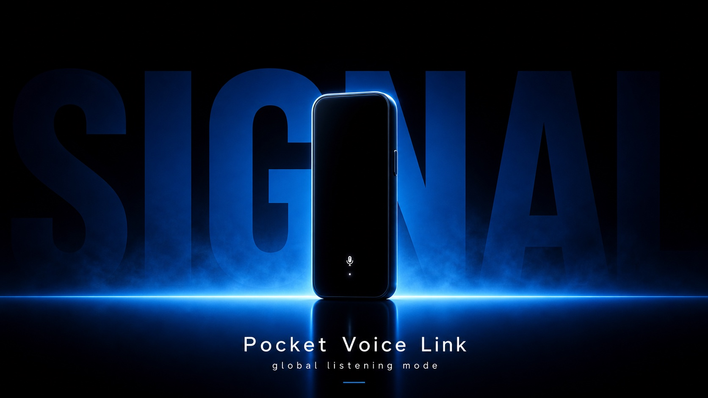

# Electric Blue Silhouette Product Launch Style



A sparse premium consumer-tech launch poster style built from black negative space, a centered product silhouette, electric-blue rim lighting, a glowing horizontal platform, soft reflection, giant cropped blue background typography, and clean white announcement copy.

## Copy Prompt

Default case: `smart-ring-launch`

```text
Use the "Electric Blue Silhouette Product Launch Style" visual style as the locked style.

Create a 16:9 image.

Subject: a brandless smart ring in a small vertical charging dock
Action: standing upright like a quiet wearable-tech hero
Prop / product: a slim circular smart ring held by a narrow matte pedestal, not a rounded earbud case
Location: a black void studio with a luminous blue tabletop
Background: a giant cropped blue word, faint blue haze, and a smooth reflective foreground
Main text: EDGE
Secondary text: Smart Ring 01 / midnight sensor launch
Accent symbol: single tiny white LED dot
Styling: no visible human body or wardrobe

Style direction:
A sparse premium consumer-tech launch poster style built from black negative space, a centered
product silhouette, electric-blue rim lighting, a glowing horizontal platform, soft reflection,
giant cropped blue background typography, and clean white announcement copy.

Keep visible:
- Nearly black upper field with large areas of empty space.
- Single product hero centered on the vertical axis or slightly below center.
- Product remains mostly black, readable through electric-blue rim light and one tiny white status highlight.
- Strong horizontal electric-blue platform or horizon line divides stage and foreground.
- Blue glow spreads across the floor with a soft reflection or shadow directly under the product.

Avoid:
No Redmi, no AirDots, no Pro wordmark, no wireless earbuds, no earbud charging case, no real
brand logos, no copied product silhouette, no copied Chinese headline, no copied date or launch
wording, no top-right brand mark, no platform UI, no carousel arrows, no page counter, no social
app dots, no watermark, no QR code, no username, no price sticker, no feature cards, no warm
badges, no orange or gold accent system, no bright catalog lighting, no lifestyle background, no
flat vector art, no comic illustration, no dense multi-object scene, no cluttered HUD interface.

Do not copy source content, real logos, watermarks, platform UI, QR codes, or exact
reference layouts. Keep the visual system, but change the subject, text, and scene.
```

## Full Style

- [Open style.json](../../styles/electric-blue-silhouette-product-launch-style/style.json)
- [Open style folder](../../styles/electric-blue-silhouette-product-launch-style/)

<!-- Generated by scripts/generate-copy-prompts.py. Do not edit manually. -->
