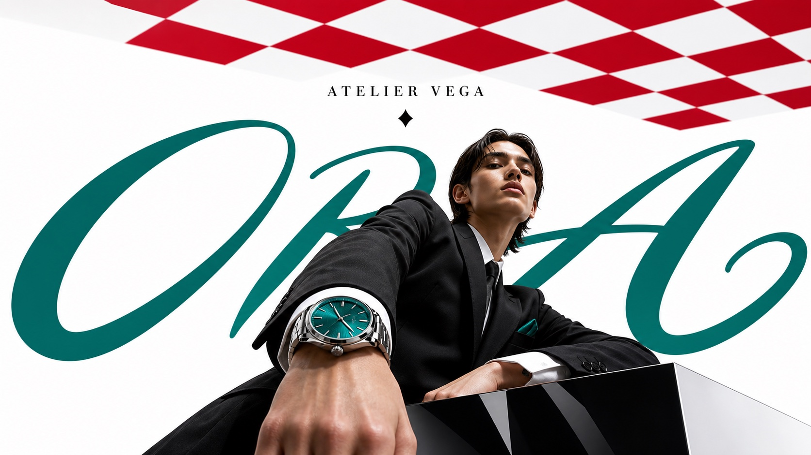

# Luxury Perspective Checkerboard Editorial



A high-fashion editorial poster style with low-angle luxury photography, sharp red-and-white checkerboard perspective planes, generous white space, oversized custom script typography, and restrained emerald or teal accents. It evokes international luxury maison advertising without copying any real brand mark, campaign, model, product, or exact layout.

## Copy Prompt

Default case: `couture-fragrance-runway`

```text
Use the "Luxury Perspective Checkerboard Editorial" visual style as the locked style.

Create a 16:9 image.

Subject: a poised couture model in a sculptural black satin coat beside an oversized crystal perfume bottle
Action: stepping forward on a red-and-white checkerboard runway while one hand hovers near the bottle
Prop / product: faceted emerald perfume bottle with minimal gold cap and no visible logo
Location: white studio runway set with a single checkerboard floor plane receding toward the camera
Background: large white void, red checkerboard perspective floor, one small emerald dot in the upper right
Main text: VELA
Secondary text: MAISON NOVA
Accent symbol: emerald dot
Styling: black satin couture coat, polished emerald gloves, clean high-fashion silhouette

Style direction:
A high-fashion editorial poster style with low-angle luxury photography, sharp red-and-white
checkerboard perspective planes, generous white space, oversized custom script typography, and
restrained emerald or teal accents. It evokes international luxury maison advertising without
copying any real brand mark, campaign, model, product, or exact layout.

Keep visible:
- Low-angle luxury editorial photography with a monumental subject scale.
- Red-and-white checkerboard or tiled graphic plane in extreme perspective.
- Large white negative space as the primary background field.
- One oversized custom script word spanning behind the subject.
- Small centered serif maison-style wordmark area near the upper field.

Avoid:
Gucci, real luxury brand logos, real monograms, trademarked slogans, copied campaign marks,
exact source model, exact source pose, black dress with chain handbag, green pointed heels,
duplicated floor-and-ceiling checkerboard layout, watermarks, creator IDs, QR codes, social
media UI, price tags, retail badges, dense captions, crowded product clusters, bargain sale
design, grunge zine collage, comic illustration, flat vector art, low-resolution output, blurry
subject, distorted anatomy, broken hands, illegible fake logo clutter, excessive text.

Do not copy source content, real logos, watermarks, platform UI, QR codes, or exact
reference layouts. Keep the visual system, but change the subject, text, and scene.
```

## Full Style

- [Open style.json](../../styles/luxury-perspective-checkerboard-editorial/style.json)
- [Open style folder](../../styles/luxury-perspective-checkerboard-editorial/)

<!-- Generated by scripts/generate-copy-prompts.py. Do not edit manually. -->
