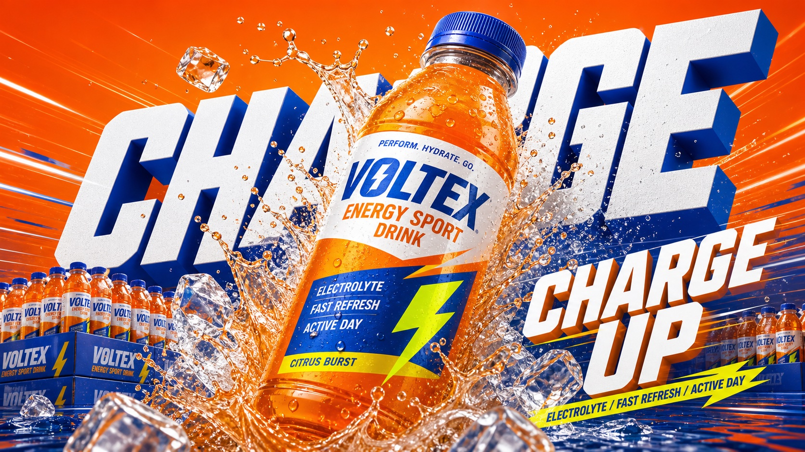

# Multi-Color Beverage Splash Ad System Style



A reusable beverage launch advertising system with four color-varied templates, built from giant white 3D typography, a diagonal hero drink pack, frozen liquid motion, dense launch-ad copy, and polished commercial product lighting.

## Copy Prompt

Default case: `lemon-tea-store-poster`

```text
Use the "Multi-Color Beverage Splash Ad System Style" visual style as the locked style.

Create a 16:9 image.

Subject: a fictional bottled low-sugar lemon tea
Action: bursting diagonally through tea splash, lemon mist, and ice shards
Prop / product: a clear bottle with amber tea liquid, lemon-yellow label bands, and a tiny green freshness seal
Location: a clean retail poster studio space
Background: giant white extruded letters spelling ZEST as abstract 3D blocks, amber side shadows, lemon slices as splash accents
Main text: LEMON ZEST
Secondary text: low sugar / fresh tea / ice cold
Accent symbol: tiny green leaf seal
Styling: no people, bright bottled-tea product styling

Style direction:
A reusable beverage launch advertising system with four color-varied templates, built from giant
white 3D typography, a diagonal hero drink pack, frozen liquid motion, dense launch-ad copy, and
polished commercial product lighting.

Keep visible:
- Each case uses one strong drink-category color system rather than a generic rainbow palette.
- Large white extruded block letters remain the main background architecture.
- The drink pack is the single close-up hero object, angled diagonally and cropped with impact.
- Splash, foam, ice, bubbles, or condensation are frozen in high-speed product-ad lighting.
- Typography is bold, condensed, italic, mostly white, and stacked into tight ad-copy blocks.

Avoid:
Sprite, Coca-Cola, real brand logo, copied Korean text, copied Z E R O layout, exact source
composition, original green soda can, 355ml label, existing beverage trademark, watermark, QR
code, platform UI, creator signature, legal microcopy, flat vector art, scrapbook collage, manga
panel, lifestyle photo, ordinary packshot, messy supermarket aisle, many small products,
unreadable tiny packaging claims, low-resolution render

Do not copy source content, real logos, watermarks, platform UI, QR codes, or exact
reference layouts. Keep the visual system, but change the subject, text, and scene.
```

## Full Style

- [Open style.json](../../styles/multi-color-beverage-splash-ad-system-style/style.json)
- [Open style folder](../../styles/multi-color-beverage-splash-ad-system-style/)

<!-- Generated by scripts/generate-copy-prompts.py. Do not edit manually. -->
