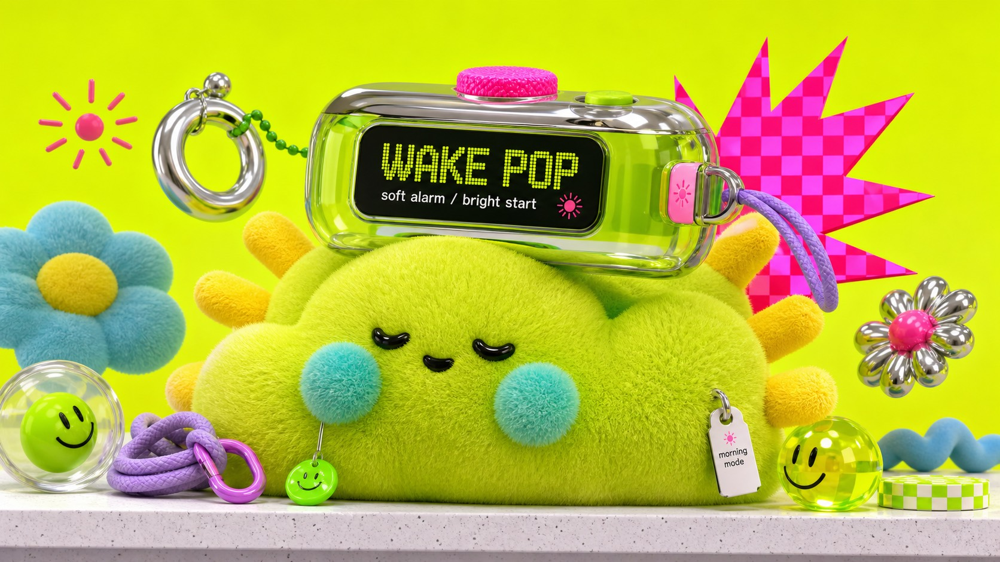

# Neon Plush Gadget Pop 3D Style



A glossy toy-advertising 3D style built from acid lime studio backdrops, oversized fuzzy plush mascots, chunky tech props, soft textile surfaces, translucent plastic accessories, checkerboard cards, sticker-like icons, hot-pink burst graphics, and bright commercial lighting.

## Copy Prompt

Default case: `bubble-tea-rocket-kiosk`

```text
Use the "Neon Plush Gadget Pop 3D Style" visual style as the locked style.

Create a 16:9 image.

Subject: a round mint-green plush moon-bunny kiosk with cyan floppy ear cushions and tiny black bead eyes
Action: leaning forward as if presenting a new drink launch
Prop / product: an oversized translucent bubble-tea rocket capsule with chrome straw ring and jelly fins
Location: minimal neon studio counter with a pale speckled shelf edge
Background: hot-pink starburst behind the capsule, lime checkerboard mini card, floating tapioca spheres, tiny smile sticker, and cyan soft blobs
Main text: BOBA GO
Secondary text: fresh orbit / sweet fuel
Accent symbol: radiating pink sparkle
Styling: plush mint knit body, cyan fleece ears, small white hang tag, lavender cord charm, and rubbery green buttons

Style direction:
A glossy toy-advertising 3D style built from acid lime studio backdrops, oversized fuzzy plush
mascots, chunky tech props, soft textile surfaces, translucent plastic accessories, checkerboard
cards, sticker-like icons, hot-pink burst graphics, and bright commercial lighting.

Keep visible:
- Acid lime or neon yellow-green studio background dominates the frame, with a soft gradient glow rather than realistic scenery.
- A single oversized plush mascot or fuzzy toy object fills the lower center, cropped close enough to feel tactile and collectible.
- Surfaces mix fuzzy knitted fabric, soft fleece, glossy molded plastic, translucent jelly material, chrome accents, and rubbery toy parts.
- The main prop is a chunky toy-like gadget or product object sitting on or hugging the plush subject.
- Palette uses electric lime as the base with cyan, sky blue, hot pink, lavender, yellow, white, chrome gray, and small black details.

Avoid:
watermark, username, creator ID, platform logo, QR code, signature, brand logo, app mark, copied
source text, VIP, membership card, unlock features text, camera on head, camera as central prop,
green dragon, dinosaur, monster head, blue snout with nostrils, same black oval eyes with yellow
rings, purple cord whiskers, FILLTER tag, barcode spray can, copied flower button, pink
basketball, same object cluster, recognizable licensed character, identifiable person, flat
vector illustration, hand-drawn poster, dark cinematic lighting, muted colors, photorealistic
room, natural scenery, retail shelf clutter, long paragraphs, corporate UI, gritty realism,
horror mood

Do not copy source content, real logos, watermarks, platform UI, QR codes, or exact
reference layouts. Keep the visual system, but change the subject, text, and scene.
```

## Full Style

- [Open style.json](../../styles/neon-plush-gadget-pop-3d-style/style.json)
- [Open style folder](../../styles/neon-plush-gadget-pop-3d-style/)

<!-- Generated by scripts/generate-copy-prompts.py. Do not edit manually. -->
